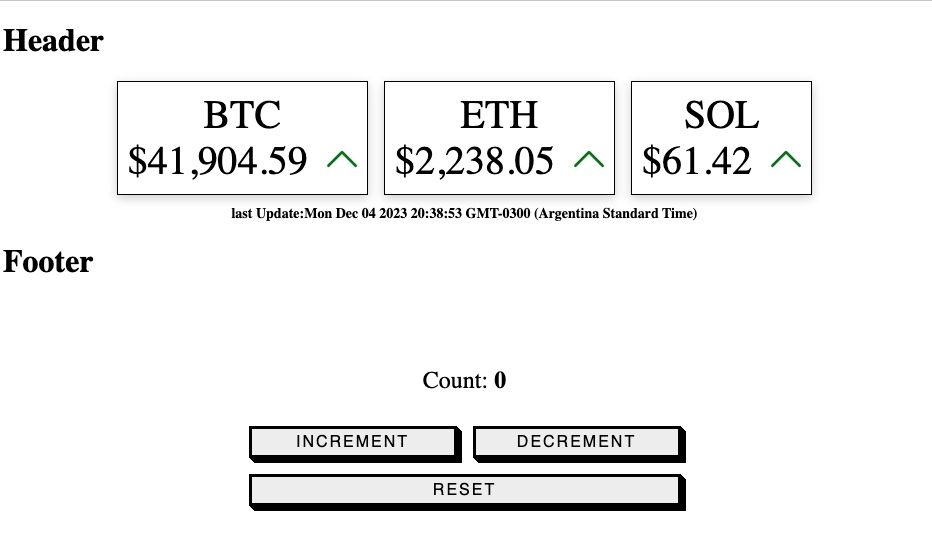

## Project Setup

```sh
npm install
```

### Compile and Hot-Reload for Development

```sh
npm run dev
```

### Compile and Minify for Production

```sh
npm run build
```
# wc-counter

An counter example of web component developed with Vue 3 and Pinia. 

The state management was taking as a guideline this tutorial:

## [Youtube video](https://www.youtube.com/watch?v=Ok6vO98RV_Q)

The UI was taken from a code pen project:

## [Code pen](https://codepen.io/matthewp/details/dyVeNrJ)


### Features
- Compatible with all Javascript frameworks (Vue, Angular, React, etc.) or no framework at all
- Pinia implementation

## [Demo](https://ginocaputo.github.io/wc-counter/demo/index.html)



In this demo link you will find two web components:

- [<coin-tracker>](https://github.com/GinoCaputo/web-component)
- [<simple-sample>](https://github.com/GinoCaputo/wc-counter)
